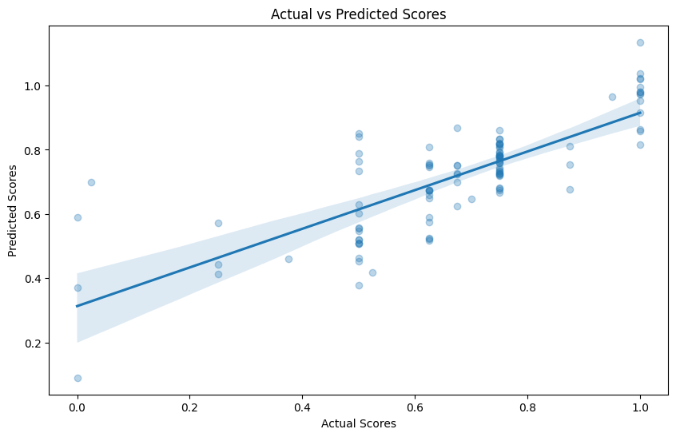
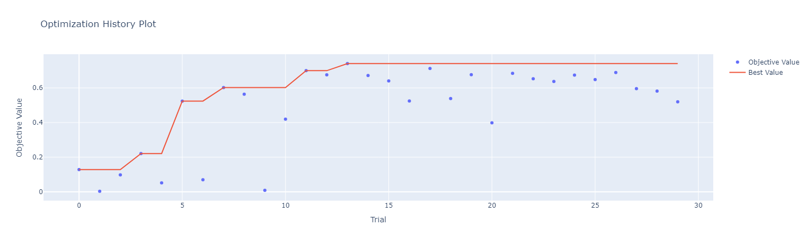

# AES-BERT INDO: Automated Essay Scoring System for Indonesian Language Essays

This project implements a machine learning-based Automated Essay Scoring (AES) system specifically designed for Indonesian language essays. The system utilizes BERT (Bidirectional Encoder Representations from Transformers) embeddings and neural networks to automatically grade student essay responses.

## Model Architecture


## Model Result Overview



## Optimisation History



## Hyperparameter importance


## Best Model Summary


## Evaluation Result

```txt
   MSE: 0.0202
   QWK: 0.7131
   R2 Score: 0.572
```

### System Components

1. **Data Processing Pipeline**
   - Loads Indonesian student essays and their respective reference answers
   - Processes raw text through normalization, stop word removal, and tokenization
   - Extracts linguistic features (vocabulary richness, average sentence length, word count)
   - Normalizes scores to a 0-1 scale (original scoring scale: 0-4)

2. **Feature Extraction Layer**
   - **SBERT Embeddings**: Uses `firqaaa/indo-sentence-bert-base` pre-trained model to generate semantic embeddings for both student answers and reference answers
   - **Linguistic Features**: Vocabulary richness, average sentence length, total word count
   - **Semantic Similarity**: Cosine similarity between student answer embeddings and reference answer embeddings

3. **Model Architecture**
   - **Type**: Deep Neural Network
   - **Input Layer**: Combined SBERT embeddings + linguistic features + similarity score
   - **Batch Normalisation** : to stabilize and accelerate the training process
   - **Hidden Layers**: Customizable number of fully connected layers with ReLU activations
   - **Regularization**: Dropout to prevent overfitting
   - **Output Layer**: Single neuron with sigmoid activation scaled to the 0-4 range
   - **Loss Function**: Mean Squared Error (MSE)

4. **Hyperparameter Optimization**
   - Uses Optuna for automated hyperparameter tuning
   - Optimizes learning rate, hidden dimension size, number of layers, dropout rate, and batch size
   - Objective: Maximize Quadratic Weighted Kappa (QWK) score

## Experiment Setup

### Dataset

- Indonesian student essay answers from multiple classes/subjects:
  - DPK (TKJ)
  - MPP (RPL)
  - MPP (PPL) 2
  - MPP (TKJ-Telkom)
- Reference answers for scoring comparison
- Scores normalized from 0-4 scale

### Preprocessing

1. Text cleaning: lowercasing, removing special characters and extra whitespace
2. Stop word removal using NLTK's Indonesian stopwords
3. Tokenization with word_tokenize and sent_tokenize
4. SBERT embedding generation (768-dimensional vectors)

### Training Methodology

1. Feature preparation:
   - Generate SBERT embeddings for all essays and reference answers
   - Extract linguistic features (vocabulary richness, sentence length, word count)
   - Calculate semantic similarity between student answers and reference answers

2. Train/Test Split:
   - 80% training, 20% testing
   - Stratified by question code to ensure balanced representation

3. Model Training:
   - PyTorch implementation with Adam optimizer
   - Early stopping with patience=5 to prevent overfitting
   - Hyperparameter optimization with Optuna (20 trials)
   - CUDA acceleration when available

### Evaluation Metrics

1. **Mean Squared Error (MSE)**: Measures average squared difference between predicted and actual scores
2. **Quadratic Weighted Kappa (QWK)**: Measures agreement between human and automated scoring
3. **R² Score**: Coefficient of determination indicating prediction quality
4. **Error Analysis**: Best/worst predictions and performance breakdown by question

## Key Features

1. **Multilingual Support**: Specifically designed for Indonesian language essays
2. **Contextual Embeddings**: Uses SBERT to capture semantic meaning rather than just keywords
3. **Hybrid Features**: Combines semantic embeddings with traditional linguistic features
4. **Reference-Based Scoring**: Incorporates similarity to reference answers in scoring
5. **Adaptive Hyperparameters**: Optimized model configuration through Optuna
6. **Interpretable Results**: Error analysis and performance breakdown by question type
7. **Practical Application**: Includes inference function for scoring new essays

## Model Performance Analysis

The system analyzes performance from multiple perspectives:
- Overall statistical metrics (MSE, QWK, R²)
- Top 5 best and worst predictions to identify patterns
- Performance breakdown by question type
- Visualization of actual vs. predicted scores

## Usage for New Essays

The system provides a `predict_new_answer()` function that:
1. Takes a new student answer and reference question code
2. Preprocesses the text and extracts features
3. Calculates similarity to reference answer
4. Returns a predicted score (0-4 scale) and processed feature details

## Technical Requirements

- Python 3.x
- PyTorch
- Sentence Transformers
- NLTK with Indonesian language resources
- Pandas, NumPy
- Scikit-learn
- Optuna for hyperparameter optimization
- CUDA support (optional, for GPU acceleration)

## Experimental Insights

The BERT-based approach demonstrates advantages over traditional bag-of-words or TF-IDF methods by:
1. Capturing semantic meaning beyond keyword matching
2. Understanding contextual relationships between words
3. Incorporating similarity to reference answers as a strong predictive signal
4. Handling the specific characteristics of the Indonesian language

The combination of semantic embeddings with traditional linguistic features provides a robust foundation for automated essay scoring, with potential for further improvements through more advanced model architectures or additional feature engineering.
